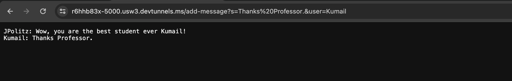

CSE 15L Lab Report 2

Kumail Karan 

A17688437

Part 1:

Code For ChatServer:

```
import java.io.IOException;
import java.net.URI;

class Handler implements URLHandler {
    String chat = "";

    public String handleRequest(URI url) {
        if (url.getPath().equals("/")) {
            return chat;
        } else if (url.getPath().equals("/add-message")) {
            String[] parameters = url.getQuery().split("=");
            String[] MessageAndUser = parameters[1].split("&");
            chat = chat+parameters[2]+": "+MessageAndUser[0]+"\n";
            return chat;

        } else {
            return "Error! Path Not Found!";
        }
    }
}

class ChatServer {
    public static void main(String[] args) throws IOException {
        if(args.length == 0){
            System.out.println("Missing port number! Try any number between 1024 to 49151");
            return;
        }

        int port = Integer.parseInt(args[0]);

        Server.start(port, new Handler());
    }
}
```
Screenshots of using /add-message:


The relevant methods and classes pertaining to this screenshot, the Handler class and it's method called handleRequest, analyzes the path inputted in the browser search.
In this screenshot, the path is r6hhb83x-5000.usw3.devtunnels.ms/add-message?s=Wow,%20you%20are%20the%20best%20student%20ever%20Kumail!&user=JPolitz. 
Then it subsequently displays the text after some manipulations (exact methology will be explained later).

The relevant arguments in each method: The handleRequest has one only parameter, which is a called `URI` type called `url`. `url` is analyzed for it's path and an output is returned and displayed onto the screen based on said path inputted into your browser search bar.

The relevant fields: `String chat = ""` is instantiated and represents the text displayed onto the screen. `String[] parameters = url.getQuery().split("=");` splits the path into `String[]` after the `/`. 
In this case the array is `[/add-messages?s, Wow, you are the best student ever Kumail!&user, JPolitz]`. 
`String[] MessageAndUser = parameters[1].split("&");` splits the second string in `String [] parameters` into another `String []`. This `String []` is now `[Wow, you are the best student ever Kumail!, user]` called `MessageAndUser`. 
Lastly we update `chat` to now be the string,
`chat = chat+parameters[2]+": "+MessageAndUser[0]+"\n";`. This is equal to the original `chat` string which was previously empty but now is added by `parameters[2]` which is `JPolitz` added by `": ` and then added again by another string `MessageAndUser[0]` which is the string `Wow, you are the best student ever Kumail!`. Finally `/n` is added to create a new line in the string for subsequent paths.
`chat` is updated to `JPolitz: Wow, you are the best student ever Kumail!` and is displayed on the screen. 


For this screenshot, the same methods and classes are called as the first screenshot. 
However in this screenshot the path is: r6hhb83x-5000.usw3.devtunnels.ms/add-message?s=Thanks%20Professor.&user=Kumail

The relevant arguments are the same as the first screenshot, however the path `URI` type variable `url` has changed to the path mentioned above.

The relevant fields: Same as the first screenshot, `String chat`, but this time it doesn't start empty. 
It has been updated based on the last screenshot to the string: `JPolitz: Wow, you are the best student ever Kumail!` with `/n` (newline) so the next path inputted shows it's text below the last input path's text.

We can see this as: 

`JPolitz: Wow, you are the best student ever Kumail!` (Inputted in the first screenshot)
`Kumail: Thanks Professor.`                           (Inputted in this screenshot)

As before we go through the same manipulations when parsing through our path, with the `String chat` being updated to: 
`JPolitz: Wow, you are the best student ever Kumail! /n Kumail: Thanks Professor. /n` 
To reiterate, `/n` just tells the program to create a new line for the subsequent path that will be analyzed for its text.

Part 2:

Private Key Path:


Public Key Path:


Terminal Interaction:


Part 3:

I didn't know you were able to use the `mkdir` command to make a directory through terminal. I also didn't know you could use the `scp` command to securely copy files
between systems.

