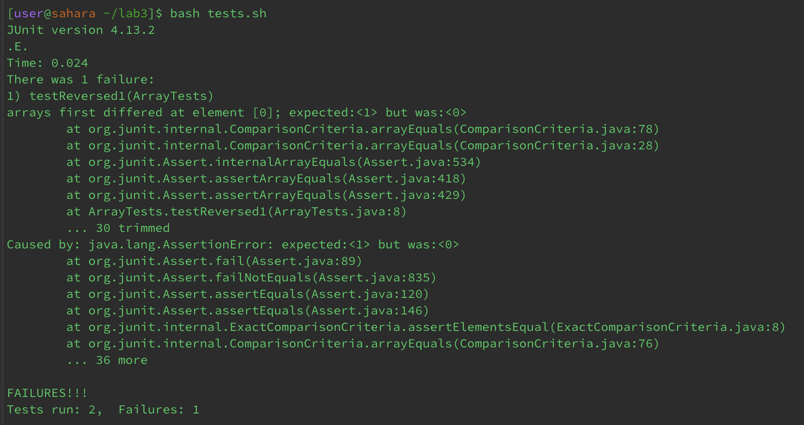
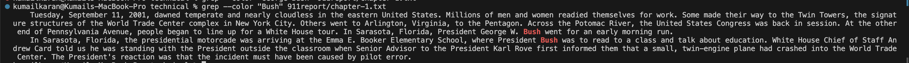
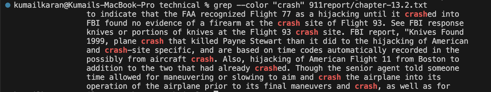

CSE15L Lab Report 3 
Kumail Karan 
PID: A17688437

Part 1 Bugs:

A failure-inducing input for the buggy program:
```
  @Test
  public void testReversed1() {
    int[] input1 = { 5,4,3,2,1 };
    assertArrayEquals(new int[]{ 1,2,3,4,5 }, ArrayExamples.reversed(input1));
  }
```
An input that doesn't induce a failure:
```
 @Test
  public void testReversed2() {
    int[] input1 = { };
    assertArrayEquals(new int[]{ }, ArrayExamples.reversed(input1));
  }
```
The symptom, as the output of running the tests:


The bug, as the before-and-after code change required to fix it:

Before:
```
static int[] reversed(int[] arr) {
    int[] newArray = new int[arr.length];
    for(int i = 0; i < arr.length; i += 1) {
      arr[i] = newArray[arr.length - i - 1];
    }
    return arr;
  }
```

After:
```
static int[] reversed(int[] arr) {
    int[] newArray = new int[arr.length];
    for(int i = 0; i < arr.length; i += 1) {
      newArray[i] = arr[arr.length - i - 1];
    }
    return newArray;
  }
```
Briefly describe why the fix addresses the issue:
The left and right hand side of the `=` was switched in the line: `arr[i] = newArray[arr.length - i - 1];`. You want to reference the items in `newArray` from smallest to largest index to the items in `arr` from largest to smallest index. So simply switch `arr` and `newArray` in the line to `newArray[i] = arr[arr.length - i - 1];` Then return `newArray` instead of `arr` because in this method `newArray` is a new array that you are creating and modifiying based on the contents in `arr` which is the argument.

Part 2 Researching Commands:

4 Ways to Use the `grep` command:

1. Using the `--color` option:

Example 1:
```
kumailkaran@Kumails-MacBook-Pro technical % grep --color "Bush" 911report/chapter-1.txt 
    Tuesday, September 11, 2001, dawned temperate and nearly cloudless in the eastern United States. Millions of men and women readied themselves for work. Some made their way to the Twin Towers, the signature structures of the World Trade Center complex in New York City. Others went to Arlington, Virginia, to the Pentagon. Across the Potomac River, the United States Congress was back in session. At the other end of Pennsylvania Avenue, people began to line up for a White House tour. In Sarasota, Florida, President George W. Bush went for an early morning run.
    In Sarasota, Florida, the presidential motorcade was arriving at the Emma E. Booker Elementary School, where President Bush was to read to a class and talk about education. White House Chief of Staff Andrew Card told us he was standing with the President outside the classroom when Senior Advisor to the President Karl Rove first informed them that a small, twin-engine plane had crashed into the World Trade Center. The President's reaction was that the incident must have been caused by pilot error.
```
Screenshot:


Example 2:
```
kumailkaran@Kumails-MacBook-Pro technical % grep --color "crash" 911report/chapter-13.2.txt
                to indicate that the FAA recognized Flight 77 as a hijacking until it crashed into
                FBI found no evidence of a firearm at the crash site of Flight 93. See FBI response
                knives or portions of knives at the Flight 93 crash site. FBI report, "Knives Found
                1999, plane crash that killed Payne Stewart than it did to the hijacking of American
                and crash-site specific, and are based on time codes automatically recorded in the
                possibly from aircraft crash. Also, hijacking of American Flight 11 from Boston to
                addition to the two that had already crashed. Though the senior agent told someone
                time allowed for maneuvering or slowing to aim and crash the airplane into its
                operation of the airplane prior to its final maneuvers and crash, as well as for
```
Screenshot:


What it's doing: 
The `grep` command in this instance has the `--color` modifier in the front of the argument that states the line of text we are searching for and the files' path. What this does is change the color of text we are looking for, so when the output is printed, we can much easily see our word(s) in big blocks of text that it may be hidden in.
I've added additional screenshots for each example to better show this in action, as markdown doesn't copy color when I copy and paste the output onto this file.

I found information regarding this option at this link: https://www.computerhope.com/unix/ugrep.htm
Scroll down a tiny bit to get the exact place where I found the information.

2. Using the `-i` option:

Example 1: 
```
kumailkaran@Kumails-MacBook-Pro technical % grep -i "pEnTaGON" 911report/chapter-6.txt     
                joint CIA-Pentagon effort that Clarke dubbed "Afghan Eyes." After much argument between the CIA and the Defense Department about
            Clarke recalled that while the Pentagon and the State Department had reservations
                rhetorically of Defense officials:"Does al Qaeda have to attack the Pentagon to get
                like in practice-either the Pentagon's new "phased campaign" concept or a prolonged
                the State Department and the Pentagon stayed on, as is typically the case. The
                team at the Pentagon did not push for action. On the contrary, Rumsfeld thought that
            The confirmation of the Pentagon's new leadership was a lengthy process. Deputy
                conflict (SOLIC), the key counterterrorism policy office in the Pentagon-never
                the White House was putting the Pentagon on notice that it would need to produce new
                ultimately went along with the CIA and the Pentagon, holding off on reconnaissance
                dead sailors, the Pentagon might have wanted to respond. Instead, they have often
```

Example 2:
```
kumailkaran@Kumails-MacBook-Pro technical % grep -i "george" 911report/chapter-3.txt 
                Meanwhile, a task force headed by Vice President George H.W. Bush had endorsed a
                George Bush and after terrorist attacks at airports in Rome and Athens, the DCI
                President Clinton appointed George Tenet as DCI in 1997, and by all accounts
                state, George Shultz, advocated active U.S. efforts to combat terrorism, often
                administration. George H.W. Bush was scheduled to visit Kuwait to be honored for his
                to be Presidential Decision Directives; for President George W. Bush, National
                Director George Tenet that the CIA's intelligence assets were "near to providing
                responsibly." George would call and say,'We just don't have it,'" Berger said.
```

What it's doing:
The `grep` command has a option of adding `-i` at beginning of the argument, this makes the text argument we are looking for case-insensitive, which means the `grep` command will look for the string of text disregarding the case status(uppercase or lowercase) of each letter in our argument. 

I found information regarding this option at this link: https://www.computerhope.com/unix/ugrep.htm
Scroll down a tiny bit to get the exact place where I found the information.

3. Using the `-n` option:

Example 1: 
```
kumailkaran@Kumails-MacBook-Pro technical % grep -n "Iraq" 911report/chapter-12.txt 
14:                on both Iraq and Afghanistan), homeland security, and international affairs rose
235:                Iraq becomes a failed state, it will go to the top of the list of places that are
382:                political controversy about whether military operations in Iraq have had any effect
479:                Iraq. American soldiers and airmen have given their lives to help protect Saudi
482:                Iraq.
508:                anti-U.S. insurgents in Iraq, although majorities also condemn jihadist attacks in
639:                Israeli-Palestinian conflict and American actions in Iraq are dominant staples of
642:                opportunity to the Arab and Muslim world. Neither Israel nor the new Iraq will be
654:                    Somalia, Bosnia, Kosovo, Afghanistan, and Iraq. If the United States does not
```

Example 2: 
```
technical % grep -n "War" 911report/chapter-13.1.txt
6:                are still the institutions constructed to win the Cold War. The United States
11:            The men and women of the World War II generation rose to the challenges of the 1940s
304:            During the Cold War, intelligence agencies did not depend on seamless integration to
373:                    following the end of the Cold War it has been less able to influence the use of
377:                    Office. One of the lessons learned from the 1991 Gulf War was the value of
654:                of inadvertent disclosure outweighs the benefits of wider sharing. Those Cold War
659:            Each intelligence agency has its own security practices, outgrowths of the Cold War.
```

What it's doing:
The `grep` command has the option of using `-n` to list out the line numbers to the left of each line where I find the text argument in my path file.

I found information regarding this option at this link: https://www.computerhope.com/unix/ugrep.htm
Scroll down a tiny bit to get the exact place where I found the information.

4. Using the `.*` option:

Example 1:
```
kumailkaran@Kumails-MacBook-Pro technical % grep "World.*Center" 911report/chapter-2.txt
                cloudy are the 1993 bombing of the World Trade Center, a plot that same year to
```

Example 2:
```
kumailkaran@Kumails-MacBook-Pro technical % grep "what was.*invader" 911report/chapter-2.txt 
                what was seen as a "holy war"-jihad-against an invader. The largest numbers came
```

What it's doing: 
Rather than having the string of text in my argument simply being encased in quotations, I can add a `.*` modifier between two words or strings of words, so it looks for any string of words where the argument before the `.*` is the beginning of the string and the argument after the `.*` is the end of the string. So in Example 1, `grep "World.*Center" 911report/chapter-2.txt`, will look for strings in `911report/chapter-2.txt` where the beginning of the string (string before `.*`) is `World` and the end of the String (string after `.*`) is `Center`, this command input was able to find the string `World Trade Center`.

I found information regarding this option at this link: https://www.computerhope.com/unix/ugrep.htm
Scroll down a tiny bit to get the exact place where I found the information.

