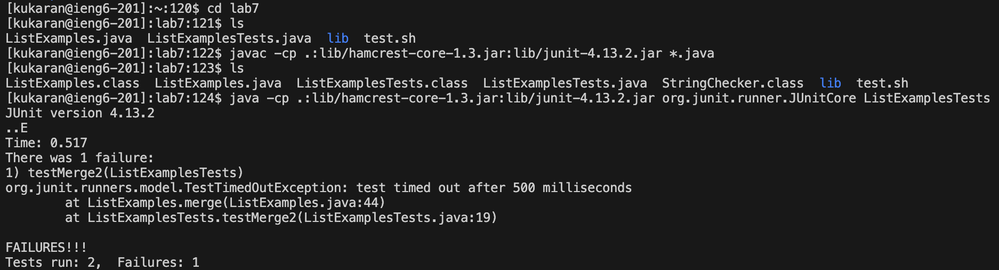

Lab Report 4 
Kumail Karan 
A17688437

Commands Typed out and Keys Pressed For Week 7 Lab Task:

Logged into ieng6:

This logs me into ieng6-201 computer/system,

`ssh kukaran@ieng6.ucsd.edu <enter>`


Cloned the forked repository:

Used `git clone` to clone the fork the repository `lab7`, 

`git clone <command v> git@github.com:kukaran/lab7.git <enter>`


Changed Current Directory to lab7, compiled and ran all the java files:

Changing directories and using `ls` to see which file to access and run,

`cd lab7 <enter>`
`ls <enter>`
`javac -cp .:lib/hamcrest-core-1.3.jar:lib/junit-4.13.2.jar *.java <enter>`
`ls <enter>`
`java -cp .:lib/hamcrest-core-1.3.jar:lib/junit-4.13.2.jar org.junit.runner.JUnitCore ListExamplesTests <enter>`

All java files in `lab7` are compiled and then I ran the `ListExamplestests.java` file.
2 tests are ran and 1 of them failed.



Entered `vim` and edited the code to fix the failing test:

Entering the `vim` edit mode on the file I want to edit,

`vim ListExamples.java <enter>`


Went to the location of the error and fixed it:

```
<down><down><down><down><down><down><down><down><down><down><down><down><down><down>
<down><down><down><down><down><down><down><down><down><down><down><down><down><down><down><down><down>
<down><down><down><down><down><down><down><down><down><down><down><down><right><right><right>
<right><right><right><right><right><right><right><right><x><i><2><ESC><:wq><enter>
``` 

43 `<down>` keys were pressed and 11 `<right>` keys.

Using `vim` editing tools, I was able to edit the `ListExamples.java` file so the `ListExamplesTest.java` runs
with all tests passing. The only edit I made was changing `index1` to `index2` on line 43.


Compling and Running the Tests again to see that they pass:

Used the `<up>` shortcut to go through my command history to get a comand I previously used,

`<up><up><up><up><enter>` Runs `javac -cp .:lib/hamcrest-core-1.3.jar:lib/junit-4.13.2.jar *.java`
Compiled all java files in `lab7`.


Same as just before,

`<up><up><up><enter>` Runs `java -cp .:lib/hamcrest-core-1.3.jar:lib/junit-4.13.2.jar org.junit.runner.JUnitCore ListExamplesTests`

Ran the tests again in `ListExamplesTests.java`, with all tests passing.


Committing Changes to github:

Using the `git commit` command to commit the changes on github,

`git commit <command v> /home/linux/ieng6/oce/43/743/kukaran/lab7 <enter>`

This allows me to commit changes I've made and update the fork I've made on my github account.

Adding the commit message using `vim` editor tools, 

`<i> Finishing Up Lab Report 4 <ESC><:wq><enter>`

This adds the commit message on github.


